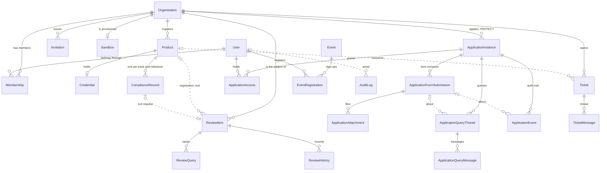
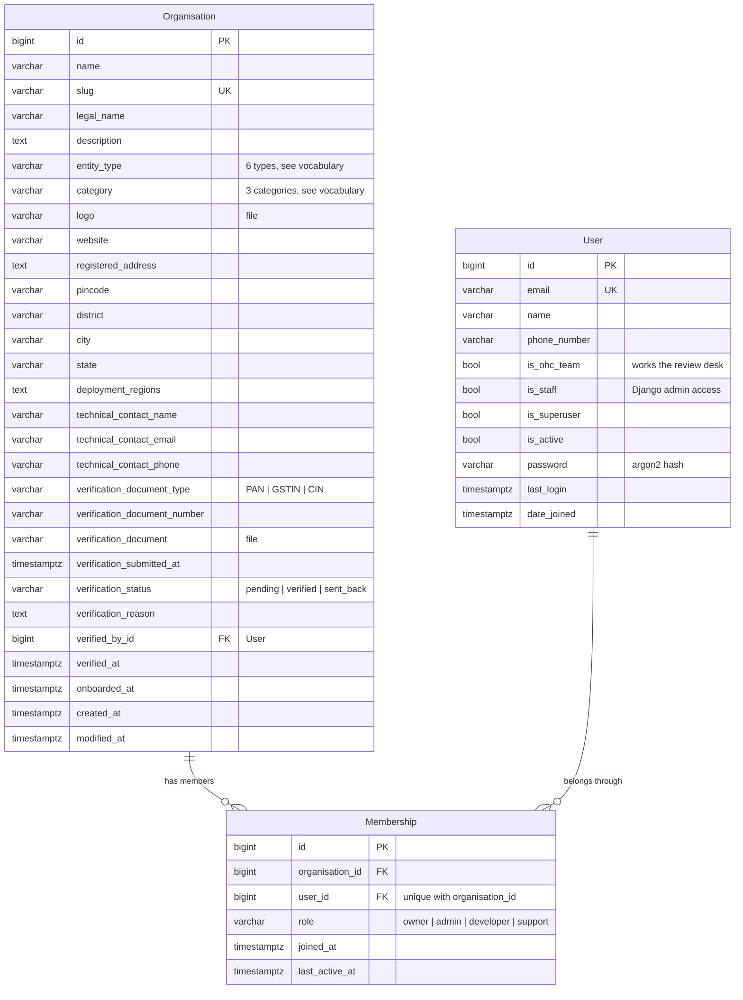
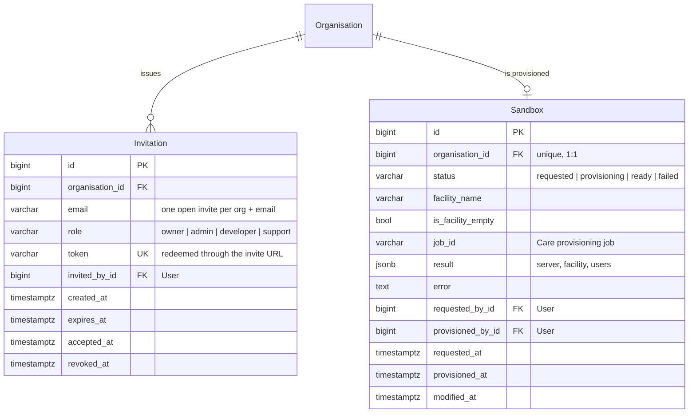
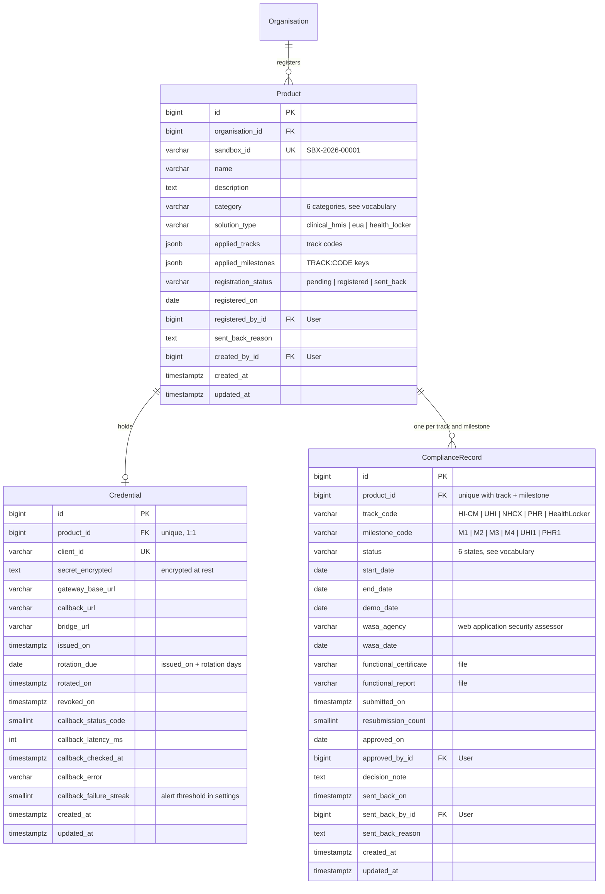
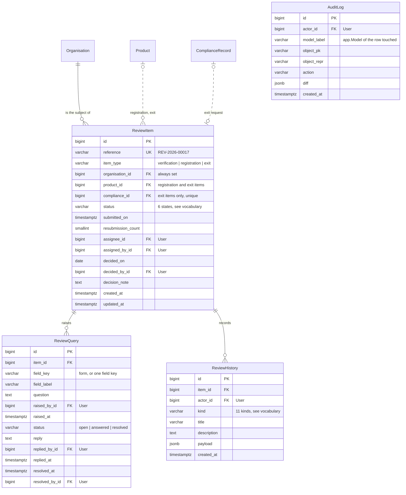
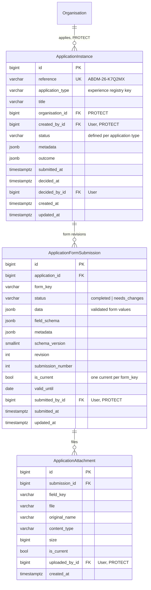
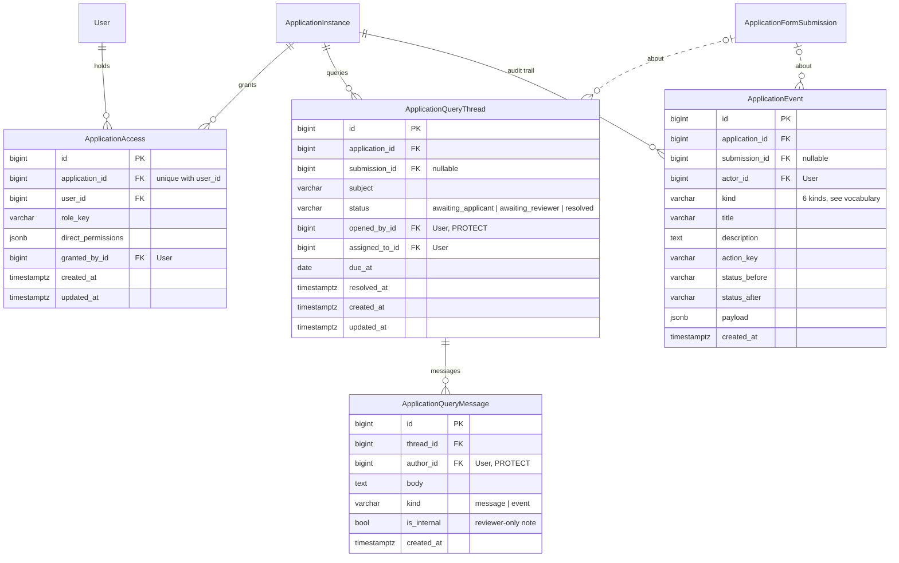
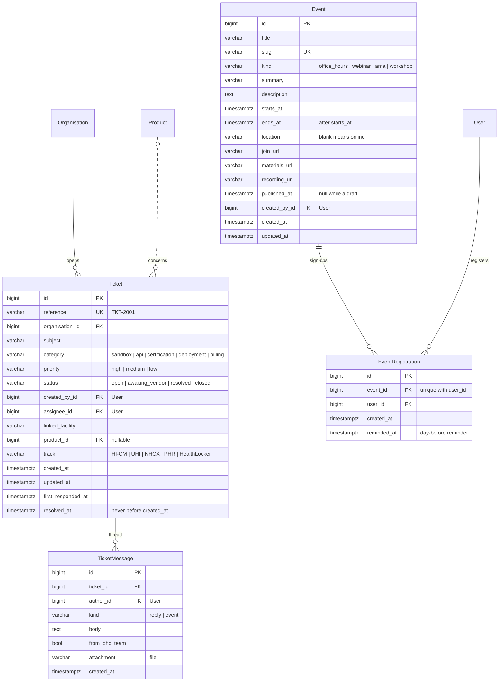

# ABDM Sandbox Portal data model

Entity-relationship reference for the OHC Experience portal, read from Django's model registry on 2026-09-09: 23 tables across six apps. Boxes without columns are entities detailed in another section. Solid lines are required foreign keys; dashed lines are nullable ones (SET_NULL). Columns commented `User` point at `users_user`.

## Overview

## Identity and organisations

_Apps: users · organisations · 5 tables_

Every integrator signs in as a User and acts through a Membership in one Organisation. The organisation is the hub of the whole model: products, tickets, applications and review items all hang off it. OHC staff are ordinary users with the is_ohc_team flag and usually no membership at all.

- Membership is unique per (organisation, user); role orders the team roster owner → admin → developer → support.
- An Invitation is unique per (organisation, email) while it is still open (neither accepted nor revoked); the token is what the invite link carries.
- Sandbox is one-to-one with Organisation: the Care sandbox provisioned by the OHC team, with the provisioning result kept as JSON.
- verified_by, invited_by, requested_by and provisioned_by point at users_user and are nulled if that user is deleted.

## ABDM sandbox and certification

_Apps: abdm · 7 tables_

A Product is the thing an integrator certifies; its sandbox_id (SBX-2026-00001) names it everywhere. A registered product holds one Credential for the gateway and one ComplianceRecord per applied milestone. Reviewers never work on those rows directly: every decision goes through a ReviewItem, whose item_type says which of three subjects it is about.

- ReviewItem always carries organisation_id; product_id is set for product_registration and exit_request items; compliance_id only for exit_request items, where it is one-to-one.
- Partial unique constraints keep one organisation_verification item per organisation and one product_registration item per product.
- ComplianceRecord is unique per (product, track_code, milestone_code). PHR:M1 is an alias of HI-CM:M1, so the canonical HI-CM row is the only one stored.
- ReviewQuery targets one field_key (or the whole form) and moves open → answered → resolved; ReviewHistory and AuditLog are append-only.
- AuditLog has no foreign key to the row it describes: model_label plus object_pk, so entries survive deletes.
- Status changes happen only in abdm/services.py; models only describe themselves.

## Application engine

_Apps: experiences · 7 tables_

A code-defined application (registry key application_type, for example the ABDM production-access flow) runs as an ApplicationInstance. Each form the applicant completes is stored as an immutable ApplicationFormSubmission revision, files live beside it as versioned attachments, and every mutation lands in ApplicationEvent.

- Submissions are unique per (application, form_key, submission_number, revision), and only one row per (application, form_key) may be current.
- ApplicationAccess grants one role plus direct permissions per (application, user); effective permissions are the union.
- Query threads may point at the submission they concern; messages flagged is_internal are visible to reviewers only.
- created_by, submitted_by, uploaded_by, opened_by and message authors are PROTECTed: a user who authored application data cannot be deleted.
- Organisation is PROTECTed by ApplicationInstance too, unlike everywhere else in the model.

## Support and events

_Apps: support · events · 4 tables_

A Ticket is one conversation between an organisation and the Care team, optionally pinned to a Product and a certification track; its thread is a list of TicketMessage rows, some of them recorded status changes rather than replies. Events are the partner calendar; a registration is one user on one event.

- Ticket references are sequential from TKT-2001, derived from the highest existing number so a deleted ticket never lends its reference.
- A check constraint keeps resolved_at at or after created_at; first_responded_at feeds the response-time figures.
- Deleting a product leaves its tickets in place with product_id nulled.
- An Event is public once published_at is set; ends_at must be after starts_at. Registrations are unique per (event, user) and reminded once, the day before.

## Vocabulary

| Column | Values |
|---|---|
| `Organisation.entity_type` | private_company · government_body · sole_proprietorship · trust_or_society · section_8 · llp |
| `Organisation.category` | india_entity · foreign_with_indian_subsidiary · academic |
| `Organisation.verification_status` | pending → verified | sent_back |
| `Membership.role, Invitation.role` | owner · admin · developer · support |
| `Sandbox.status` | requested → provisioning → ready | failed |
| `Product.category` | hmis · lmis · phr_app · health_locker · payer_tpa · other |
| `Product.solution_type` | clinical_hmis · eua · health_locker |
| `Product.registration_status` | pending → registered | sent_back |
| `ComplianceRecord.status` | locked → open → in_progress → under_review → query_raised | approved |
| `ReviewItem.item_type` | organisation_verification · product_registration · exit_request |
| `ReviewItem.status` | new → in_review → query_raised | approved | sent_back | withdrawn |
| `ReviewQuery.status` | open → answered → resolved |
| `ReviewHistory.kind` | submitted · resubmitted · started · assigned · query_raised · query_answered · query_resolved · approved · sent_back · withdrawn · milestone |
| `ApplicationFormSubmission.status` | completed · needs_changes |
| `ApplicationQueryThread.status` | awaiting_applicant · awaiting_reviewer · resolved |
| `ApplicationQueryMessage.kind` | message · event |
| `ApplicationEvent.kind` | created · form_submitted · action · status_changed · access_changed · query |
| `Ticket.category` | sandbox · api · certification · deployment · billing |
| `Ticket.priority` | high · medium · low |
| `Ticket.status` | open ⇄ awaiting_vendor → resolved → closed |
| `TicketMessage.kind` | reply · event |
| `Event.kind` | office_hours · webinar · ama · workshop |

### Tracks and milestones

| Track | Name | Milestones |
|---|---|---|
| `HI-CM` | Health information exchange and consent manager | M1 · M2 · M3 · M4 |
| `UHI` | Unified health interface | UHI1 |
| `NHCX` | National health claims exchange | no milestones defined yet |
| `PHR` | Personal health records | M1 (alias of HI-CM:M1) · PHR1 |
| `HealthLocker` | Health locker | PHR1 |

### Identifiers

| Column | Example | Rule |
|---|---|---|
| `Product.sandbox_id` | `SBX-2026-00001` | SBX-year-sequence; the sequence restarts each year and is derived from the highest existing id. |
| `ReviewItem.reference` | `REV-2026-00017` | Same scheme with the REV prefix. |
| `Ticket.reference` | `TKT-2001` | Sequential from a seed of 2000, so the first ticket is never TKT-1. |
| `ApplicationInstance.reference` | `ABDM-26-K7Q2MX` | Definition prefix (APP by default, ABDM for the production-access flow), two-digit year, six random characters. |

## Deletion rules

- **Delete an organisation.** Cascades to memberships, invitations, the sandbox, products (and through them credentials, compliance records and review items with their queries and history) and tickets with their messages. Blocked while any ApplicationInstance references it.
- **Delete a user.** Blocked while they authored application data (instances, submissions, attachments, query threads, query messages). Otherwise memberships, event registrations and access grants cascade, and every actor column (verified_by, assignee, approved_by, raised_by, actor …) is set to NULL so history keeps reading.
- **Delete a product.** Cascades to its credential, compliance records and review items. Tickets survive with product_id nulled.
- **Delete a review item.** Cascades to its queries and history. The compliance record it reviewed stays.

## Not drawn

Third-party tables installed alongside: allauth (account_emailaddress, account_emailconfirmation, socialaccount_*, mfa_authenticator), django_celery_beat_*, auth_group, auth_permission, django_admin_log, django_content_type, django_session, django_site. `users_user` also carries Django's `groups` and `user_permissions` many-to-many tables.
